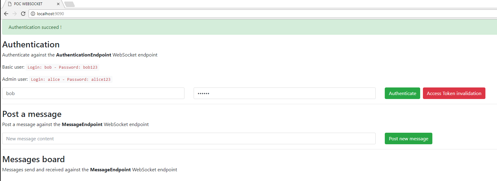
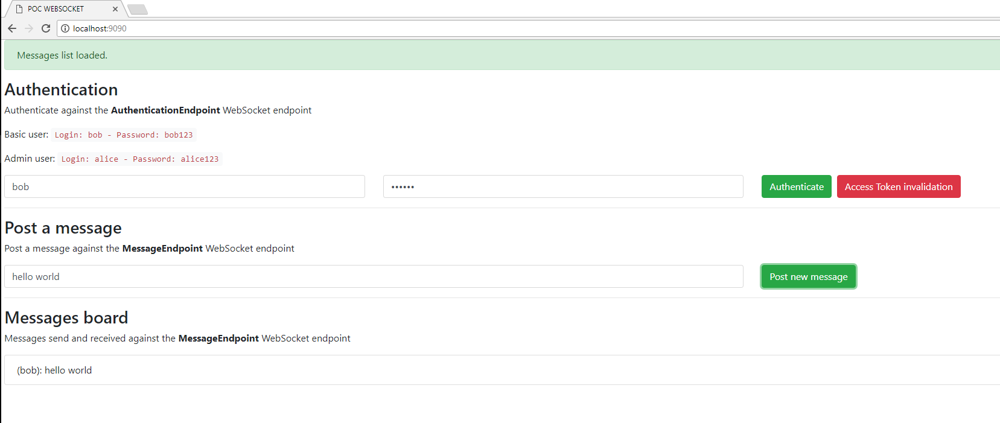
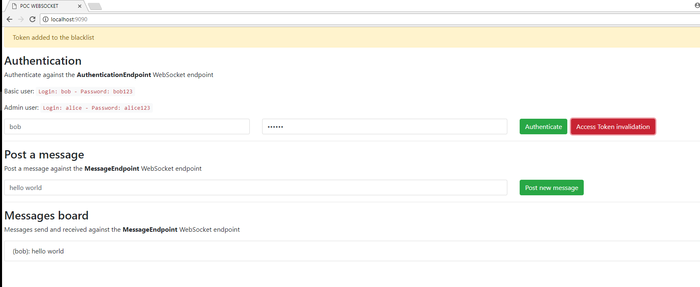
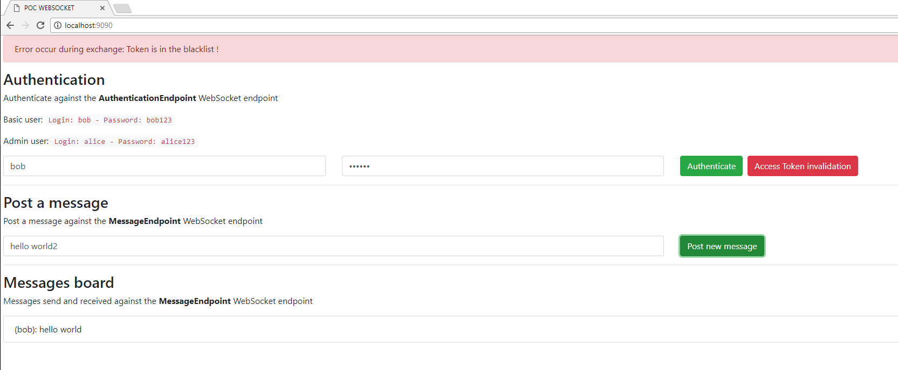

# Objective

This project is a prototype in order to materialize prevention concepts described in the following OWASP cheatsheet, in *WebSocket* section:

https://www.owasp.org/index.php/HTML5_Security_Cheat_Sheet#WebSockets

All classes are fully documented.

The project is developed with Maven under IntelliJ IDEA Community Edition.

A web page propose a UI to test the differents protection and use cases.









# Build or Run

Run the following command to create a WAR archive:
```
mvn clean package
```

Run the following command to run the prototype (it will exposed on **http://localhost:9090**):
```
mvn tomcat7:run-war
```

You can also launch the run configuration named **Run POC** directly from the project opened in IntelliJ IDEA.
